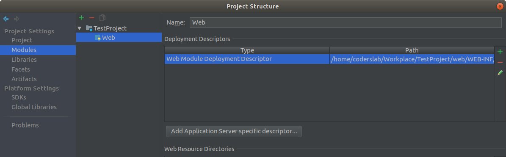
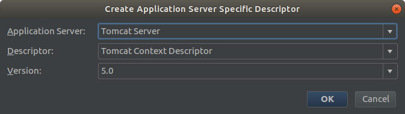
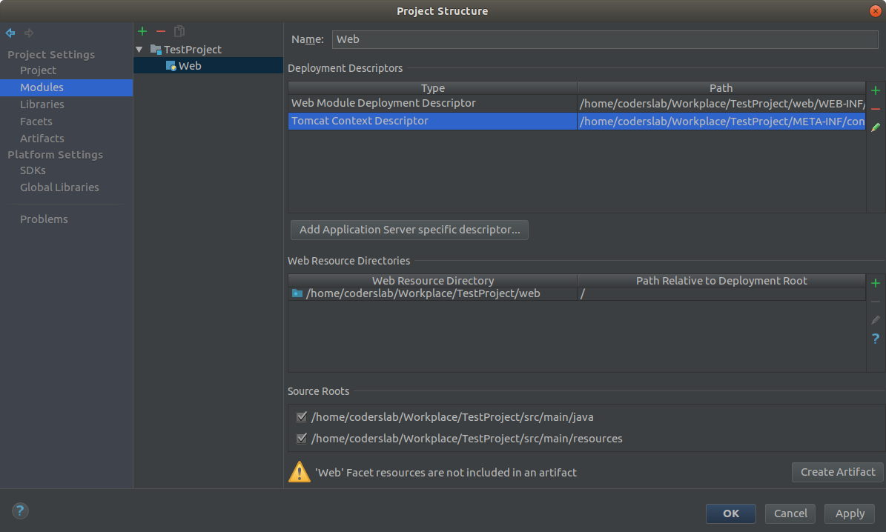

### WSPÓLNY PROJEKT

Pliki **css** możemy umieścić w katalogu 
````src/main/webapp/css````
przy powyższej lokalizacji w plikach szablonów załączamy je w następujący sposób:
````
  <link href='<c:url value="/css/style.css"/>' rel="stylesheet" type="text/css">
```` 
Jako przykład został dołączony servlet `HomeServlet` wskazujący home.jsp, dla którego wyświetla się poprawny szablon strony głównej.

### Dane do połączenia z bazą: KTOS TU COS ZMIENIL

Plik znajduje się w naszym projekcie w katalogu **src/main/webapp/META-INF**.

`Zmodyfikuj znajdujące się w nim dane dotyczące połączenia.`

### W przypadku wystąpienia błędu:
````
javax.naming.NameNotFoundException: Name [jdbc/scrumlab] is not bound in this Context. Unable to find [jdbc].
````
wykonujemy następujące kroki:

Wybierz z górnego menu File –> Project Structure...

W okienku, które się pojawi, kliknij z lewej strony w Facets następnie **Web**.

Pojawi się okno, w którym kliknij **Add Application Server specific descriptor...**.



Wybierz z listy serwer **Tomcat** i zaakceptuj przyciskiem **OK**.



Na liście pojawi się plik **Tomcat Context Descriptor**. Potwierdź przyciskiem **OK**.



Plik znajduje się w naszym projekcie w katalogu **src/main/webapp/META-INF**.

`Zmodyfikuj znajdujące się w nim dane dotyczące połączenia.`
